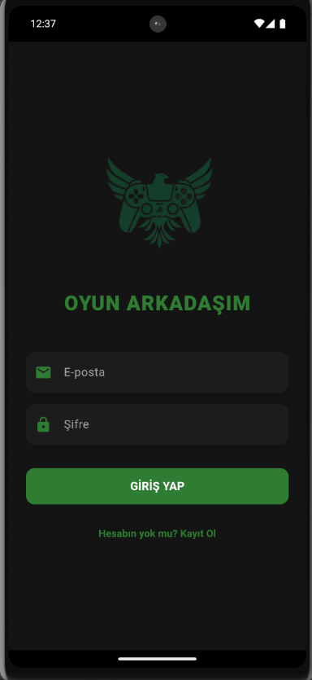
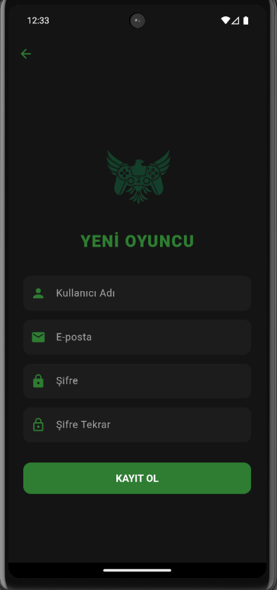

<h1 align="center">🎮 Oyun Arkadaşım</h1>

  <b>"Eksik adam yüzünden iptal olan maçlara, tek başına oynamak zorunda kaldığın oyunlara son!"</b>

Oyun Arkadaşım, ister halı sahada futbol, ister kortta tenis, isterse de dijital dünyada takım arkadaşı arayan oyuncuları tek bir çatı altında buluşturan, güven odaklı bir sosyal eşleşme ve ilan platformudur.

## ❓ Hangi Sorunları Çözüyoruz?
Gündelik hayatta spor yapmak veya oyun oynamak isteyenlerin karşılaştığı en büyük sorunlar şunlardır:
1. **Adam Eksikliği:** 14 kişilik halı saha maçına 13 kişi bulunması ve o son kişinin bir türlü bulunamaması.
2. **Partner Bulamama:** Tenis, basketbol gibi sporları yapmak isteyip çevresinde o spora ilgi duyan arkadaşı olmayanlar.
3. **Güven Problemi:** İnternetten rastgele bulunan kişilerin maça gelmemesi veya oyun ahlakına uymaması (Toxic davranışlar).

## 💡 Bizim Çözümümüz:
Oyun Arkadaşım ile kullanıcılar aradıkları branşta (Futbol, Basketbol, Tenis vb.), lokasyonda ve saatte ilan açabilirler. En önemlisi; platformdaki **"Güven Puanı"** ve **"İlan Değerlendirme"** sistemi sayesinde, kullanıcılar maça çağırdıkları kişinin ne kadar güvenilir ve uyumlu olduğunu önceden görebilirler.

---

## 📱 Uygulama Ekranları ve Özellikleri

### 1. Giriş ve Kayıt Ekranları
Kullanıcıları sade ve karanlık mod (Dark Mode) destekli, göz yormayan bir arayüz karşılıyor. Kullanıcılar güvenli bir şekilde hesap oluşturup sisteme dahil olabilirler.

  
  &nbsp;&nbsp;&nbsp;&nbsp;
  

### 2. Ana Sayfa (İlan Akışı)
Uygulamanın kalbi burasıdır. Kullanıcılar üst kısımdaki kategorileri kullanarak filtreleme yapabilir. İlan kartlarında; ilanı açan kişi, lokasyon, tarih/saat ve kaç kişi arandığı gibi kritik bilgiler tek bakışta görülür.

  

### 3. İlan Oluşturma
Sadece birkaç saniye içinde ihtiyacın olan oyuncuyu bulmak için ilan açabilirsin. Gerekli veriler girildikten sonra alt kısımdaki "Önizleme" kartı sayesinde ilanın nasıl görüneceği anında test edilir.

  

### 4. İlan Detayları, Etkileşim ve Bildirimler
Kullanıcılar ilan detaylarında yorumlar üzerinden iletişime geçebilir. Maç bittikten sonra "Bu ilana puan ver" slider'ı üzerinden değerlendirme yapılabilir. Bildirimler sekmesi ile etkileşimler anlık takip edilir.

  
  &nbsp;&nbsp;&nbsp;&nbsp;
  

### 5. Profil ve Güven Sistemi
Profilde aktif/geçmiş ilanlar, "Hakkında" yazısı ve platformdaki en önemli metrik olan **Güven Puanı** yer alır. Güven puanı, kullanıcının katıldığı etkinliklerden aldığı değerlendirmelere göre şekillenir.

  
  &nbsp;&nbsp;&nbsp;&nbsp;
  

---

## 🛠️ Kullanılan Teknolojiler (Tech Stack)

* **Frontend:** Flutter & Dart
* **Backend:** Golang & Fiber Framework
* **Veritabanı:** PostgreSQL (sqlc mimarisi ile)
* **Güvenlik:** JWT Token Authentication & Flutter Secure Storage
* **Mimari:** RESTful API & Provider State Management
